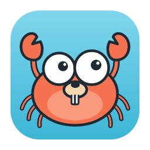

<p align="center"></p>

# Crab

[](https://github.com/hmiguel/crab/actions/workflows/ci.yml)
[](https://github.com/hmiguel/crab/releases)
[](#license)

An open-source, cross-platform desktop API client for plain `.http` / `.rest` files. **Website:** [crab-ekq.pages.dev](https://crab-ekq.pages.dev)

Your requests stay as text files in your repositories. Crab doesn't need an account, a cloud sync or a proprietary collection format. It reads the same files as the JetBrains HTTP Client and the VS Code REST Client, so your team can keep using whatever editor they like.

> **Status:** v0.1, early. macOS is the primary development platform. Windows installers are built by CI but are not tested yet.

## Features

- **Workspace across repositories.** Group folders from any number of repos into named virtual folders. The sidebar lists every `.http`/`.rest` file and the requests inside it.
- **Editor tabs** with `.http` syntax highlighting, a ▶ marker on every request line, and inline warnings for malformed lines.
- **Quick open** with <kbd>⌘</kbd><kbd>P</kbd> (<kbd>Ctrl</kbd><kbd>P</kbd> on Windows): fuzzy-search every file and request in the workspace by name, URL or path, or find text inside headers and bodies, and jump straight to it.
- **Run the request under the cursor** with <kbd>⌘</kbd><kbd>Enter</kbd> (<kbd>Ctrl</kbd><kbd>Enter</kbd> on Windows) or by clicking ▶. Unsaved edits are what gets sent. <kbd>Esc</kbd> cancels a running request.
- **Response viewer**
  - **Body:** pretty-printed, foldable JSON. Big integers are never rounded. Images render inline.
  - **Raw**, **Headers**, **Timing** (total, time to first byte, size).
  - **Request:** exactly what was sent, with every variable resolved.
- **Variables:** `@name = value` file variables, nested `{{references}}`, and the dynamic values `{{$guid}}`, `{{$uuid}}`, `{{$timestamp}}` and `{{$randomInt min max}}`.
- **Session restore:** open tabs, cursor positions, layout and **unsaved drafts** come back after a restart.
- **Files are the source of truth**
  - Crab writes a file only when you press <kbd>⌘</kbd><kbd>S</kbd>.
  - Files changed by another program reload automatically. If you have unsaved edits, Crab asks first.
  - Windows line endings (CRLF) and a UTF-8 BOM are preserved.
- Light and dark themes that follow the OS.

## Install

### macOS

1. Download the latest `Crab_<version>_universal.dmg` from [Releases](../../releases). It runs on both Apple Silicon and Intel Macs.
2. Open the `.dmg` and drag **Crab** to **Applications**.
3. Crab isn't signed with an Apple Developer certificate (it's a free, unfunded project), so macOS blocks the first launch with a warning. Allow it once:
   - **macOS 15 Sequoia and later:** open Crab, dismiss the warning, then go to **System Settings → Privacy & Security**, scroll down and click **Open Anyway** next to the Crab message.
   - **macOS 14 and earlier:** right-click **Crab** in Applications and choose **Open**.
   - **Or, in Terminal**, which works on any version:

     ```bash
     xattr -dr com.apple.quarantine /Applications/Crab.app
     ```

### Windows

Download the `.msi` or `-setup.exe` from [Releases](../../releases). The installers are unsigned, so SmartScreen will ask you to confirm: choose **More info → Run anyway**. Windows support is still being tested.

## Quick start

1. Click **＋** next to *Workspace* and pick a folder that contains `.http` files.
2. Click a file to open it. Its requests are listed under it in the sidebar.
3. Put the cursor inside a request and press <kbd>⌘</kbd><kbd>Enter</kbd>.

To try it, save this as `requests.http`:

```http
@host = httpbin.org

### Get
GET https://{{host}}/get
Accept: application/json

### Create item
POST https://{{host}}/post
Content-Type: application/json
X-Request-Id: {{$guid}}

{
  "name": "crab",
  "createdAt": {{$timestamp}}
}

### Upload a body from a file (path relative to this .http file)
POST https://{{host}}/post
Content-Type: application/json

< ./payload.json
```

## `.http` syntax supported

| Syntax | Meaning |
|---|---|
| `###` or `### Name` | Starts a new request (and optionally names it) |
| `# @name createItem` | Names the request |
| `#` / `//` | Comment |
| `METHOD URL [HTTP/1.1]` | Request line. The method defaults to `GET`. A URL without a scheme gets `http://` |
| `  ?a=1` / `  &b=2` | Query string continued on the next lines |
| `Name: value` | Header |
| blank line, then text | Request body |
| `< ./file.json` | Body read from a file |
| `@name = value` | File variable, used as `{{name}}` |
| `{{$guid}}` `{{$uuid}}` `{{$timestamp}}` `{{$randomInt 1 10}}` | Dynamic values |
| `> `, `>> out.json` | JetBrains response handlers. They are skipped and never sent; running them is on the roadmap |

## Keyboard shortcuts

| Action | macOS | Windows |
|---|---|---|
| Run request at cursor | <kbd>⌘</kbd><kbd>Enter</kbd> | <kbd>Ctrl</kbd><kbd>Enter</kbd> |
| Cancel running request | <kbd>Esc</kbd> | <kbd>Esc</kbd> |
| Save file | <kbd>⌘</kbd><kbd>S</kbd> | <kbd>Ctrl</kbd><kbd>S</kbd> |
| Close tab | <kbd>⌘</kbd><kbd>W</kbd> | <kbd>Ctrl</kbd><kbd>W</kbd> |

Middle-click a tab to close it. The **Response: right/bottom** button in the status bar moves the response panel.

## Where Crab keeps its data

Crab only stores its own state: your workspace folders and the open-tab session, including drafts. Request files are never copied.

- macOS: `~/Library/Application Support/dev.crabhttp.desktop/`
- Windows: `%APPDATA%\dev.crabhttp.desktop\`

## Build from source

Requirements:
- Rust (stable), via [rustup](https://rustup.rs).
- Node 20 or later, and pnpm 10 (`npm i -g pnpm@10`).
- macOS: Xcode Command Line Tools (`xcode-select --install`).
- Windows: the [Tauri prerequisites](https://v2.tauri.app/start/prerequisites/), which are WebView2 and the MSVC build tools.

```bash
pnpm install
pnpm tauri dev           # run the app with hot reload
pnpm tauri build         # build an installer into target/release/bundle/
```

Run the tests:

```bash
pnpm build               # needed once before any cargo command (Tauri embeds dist/)
pnpm test                # frontend unit tests (Vitest)
cargo test --workspace   # parser, resolver, executor and file tests
cargo clippy --workspace --all-targets -- -D warnings
```

### Project layout

```
crates/crab-core/   Pure Rust: .http parser, {{variable}} resolver, HTTP executor, file helpers.
                    It has no Tauri dependency, so a future CLI and MCP server can reuse it.
src-tauri/          Thin Tauri v2 shell: commands that call crab-core, and a file watcher
src/                React + TypeScript UI: CodeMirror 6 editor, zustand stores, components
docs/               Design spec and implementation plan
```

## Roadmap

Planned next:
- Environments (`http-client.env.json`, `.env`) and searchable request history.
- A `crab` CLI and an MCP server.
- Request chaining, response handler scripts and assertions.
- Import from cURL, Postman and Insomnia.
- WebSocket, SSE and gRPC.

See [ROADMAP.md](ROADMAP.md) for details.

## Contributing

Issues and pull requests are welcome. See [CONTRIBUTING.md](CONTRIBUTING.md) and the [Code of Conduct](CODE_OF_CONDUCT.md). Report security issues privately as described in [SECURITY.md](SECURITY.md). Release steps are in [RELEASING.md](RELEASING.md), and changes are tracked in [CHANGELOG.md](CHANGELOG.md).

## License

Licensed under either of [Apache License 2.0](LICENSE-APACHE) or [MIT license](LICENSE-MIT), at your option.

Unless you explicitly state otherwise, any contribution you intentionally submit for inclusion in Crab is dual-licensed as above, without any additional terms or conditions.

Crab bundles third-party open-source software; their licenses are listed in [THIRD_PARTY_LICENSES.md](THIRD_PARTY_LICENSES.md), which also ships inside the app.
